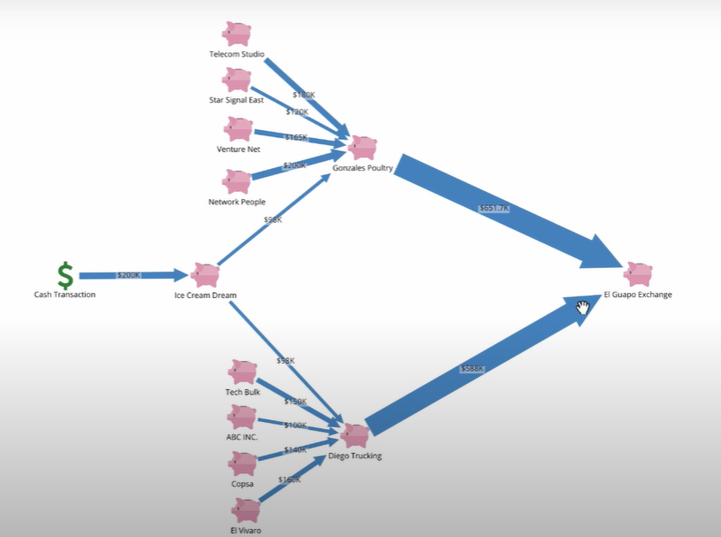

### Summer1403-Project-Group04-Backend

---

# Relationship Analysis

## Project Overview

**Relationship Analysis** is a powerful tool designed to visualize and process various entities and data as nodes and edges in graphs. This application aids data analysts in understanding the connections and relationships between disparate pieces of information. Leveraging the **EAV (Entity-Attribute-Value)** model for dynamic data structuring, the project emphasizes clean coding practices and modularity. Built using the **ASP.NET Core** framework, the tool simplifies complex investigations such as banking fraud, tax evasion, and money laundering cases by offering intuitive graph-based visualizations.

---

## Collaborators
This project was developed by:

- [**Mohammad Saleh Mahdinejad**](https://github.com/msmahdinejad)(Back-end)
- [**Sadeq Jabbari**](https://github.com/SwimmingRieux)(Back-end)
- [**Mohammad Hussein Chahkandi**](https://github.com/muhuchah)(DevOps)

The front-end portion of this project was developed by a two-person team consisting of:

- [**Arash Azarpoor**](https://github.com/Arash-Azarpoor)(Front-end)
- [**Armin Moradi**](https://github.com/Arminmow)(Front-end)

You can find the **front-end repository** [here](https://github.com/Star-Academy/Summer1403-Project-Group04-Frontend).

---

## Project Introduction

Imagine investigating a case of banking fraud, tax evasion, money laundering, or any other financial misconduct. Without a proper visualization tool, you would have to spend an enormous amount of time manually sifting through multiple databases to piece together the required data. Even after obtaining the information, additional effort is needed to connect the dots and understand relationships between various entities.

Visualization is one of the most effective ways to analyze data. By representing entities and their relationships in the form of a graph, we can reveal connections that are otherwise hidden. In this project, we aim to develop a tool that allows data analysts to visualize, explore, and analyze relationships using graphs, thus facilitating the investigation of various relationship-driven problems.

---

## Key Features

### 1. Authentication
- Users create accounts and authenticate using **JWT tokens** and **cookies** for secure access. This ensures that each user’s access level is controlled and permissions are enforced throughout the system.

### 2. Dynamic Data Structure
- The project models everything in the system as one of the following:
  - **Graph Nodes (Vertices)**
  - **Graph Edges (Relationships)**
  - **Attributes** of either nodes or edges
  
- The **EAV (Entity-Attribute-Value)** approach in the database enables the system to dynamically work with various data types, allowing for future scalability and ease of adapting new types of data to the graph.

   

  Below is a sample of our database structure, designed to accommodate the dynamic nature of the data:

   

### 3. Search Functionality
- Thanks to the dynamic graph system, users can perform complex searches across both the attributes of graph nodes and edges. This functionality allows for powerful filtering and data retrieval based on user-defined criteria.

### 4. Node Expansion
- Users can explore the full scope of relationships by expanding from a selected node to reveal all its connected nodes.

   

### 5. Sanitizer Middleware
- To enhance security and data integrity, sanitizer middleware was integrated to ensure all input data is properly sanitized before processing. This prevents injection attacks and ensures that the data conforms to expected formats.

---

## Challenges, Benefits, and Key Learnings

This project presented several technical challenges, offering valuable experience across a variety of domains:

- **ASP.NET Core Web API:** Developed robust, scalable RESTful services for data visualization and processing.
- **Clean Code:** Emphasized maintainability, readability, and adherence to **SOLID** principles for long-term sustainability.
- **Code Coverage:** Achieved approximately **90% coverage**, reflecting our commitment to high-quality, reliable code.
- **Unit and Integration Testing:** Implemented a comprehensive suite of **164 tests** using various testing libraries to ensure reliability at both unit and system levels.
- **Test-Driven Development (TDD):** Followed the TDD methodology, ensuring each feature was built with test coverage and delivered with confidence.
- **PostgreSQL & EFCore:** Managed complex relational data efficiently, focusing on performance optimization.
- **Sanitizer Middleware:** Integrated middleware for sanitizing inputs, preventing potential security vulnerabilities such as SQL injection.
- **Pair Programming:** Fostered collaboration and improved code quality through pair programming.
- **Performance Optimization:** Enhanced performance for large datasets and complex query execution.
- **JWT Authentication & Security:** Employed JWT tokens for secure user authentication and authorization.
- **Problem-Solving & Algorithmic Thinking:** Applied algorithmic methods to effectively model and visualize relationships between different entities.

---
